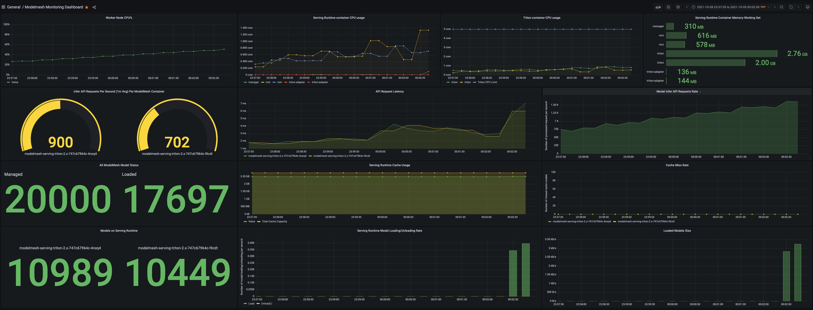

## Introduction
The ModelMesh Serving runtime pods expose metrics HTTP endpoints, `/metrics` and on port `2112`, by default. The best way to see metrics is to use Prometheus to collect them from targets by scraping the metrics HTTP endpoints and visualizing them in a Grafana dashboard.

The steps involve:
1. [Setup Prometheus Operator](#Setup-Prometheus-Operator)
2. [Apply ServiceMonitor custom resource](#Create-ServiceMonitor-CRD)
3. [Create Grafana dashboard](#Import-Grafana-Dashboard)

## Setup Prometheus Operator
The Prometheus Operator is the easiest way to setup both Prometheus and Grafana natively in a Kubernetes cluster. Please setup using the [Quickstart](https://github.com/prometheus-operator/kube-prometheus#quickstart) instructions.
By default, the operator sets RBAC rules to enable monitoring for the `default`, `monitoring` and `kube-system` namespaces to collect Kubernetes and node metrics.

### Monitor Additional Namespaces
To monitor the `modelmesh-serving` namespace, in the cloned `kube-prometheus` repository, add the following to `manifests/prometheus-roleBindingSpecificNamespaces.yaml`:

```yaml
- apiVersion: rbac.authorization.k8s.io/v1
  kind: RoleBinding
  metadata:
    labels:
      app.kubernetes.io/component: prometheus
      app.kubernetes.io/name: prometheus
      app.kubernetes.io/part-of: kube-prometheus
      app.kubernetes.io/version: 2.30.2
    name: prometheus-k8s
    namespace: modelmesh-serving
  roleRef:
    apiGroup: rbac.authorization.k8s.io
    kind: Role
    name: prometheus-k8s
  subjects:
  - kind: ServiceAccount
    name: prometheus-k8s
    namespace: monitoring
```

and to `manifests/prometheus-roleSpecificNamespaces.yaml`:
```yaml
- apiVersion: rbac.authorization.k8s.io/v1
  kind: Role
  metadata:
    labels:
      app.kubernetes.io/component: prometheus
      app.kubernetes.io/name: prometheus
      app.kubernetes.io/part-of: kube-prometheus
      app.kubernetes.io/version: 2.30.2
    name: prometheus-k8s
    namespace: modelmesh-serving
  rules:
  - apiGroups:
    - ""
    resources:
    - services
    - endpoints
    - pods
    verbs:
    - get
    - list
    - watch
  - apiGroups:
    - extensions
    resources:
    - ingresses
    verbs:
    - get
    - list
    - watch
  - apiGroups:
    - networking.k8s.io
    resources:
    - ingresses
    verbs:
    - get
    - list
    - watch
```

### Increase Retention Period
By default, Prometheus only keeps a 24 hour history record. To increase the retention period, modify `manifests/prometheus-prometheus.yaml` by adding:
```yaml
spec:
  ...
  resources:
    requests:
      memory: 400Mi
  # To change the retention period to 7 days, add the line below
  retention: 7d
  ...
```
Other configurable Prometheus specs are listed [here](https://github.com/prometheus-operator/prometheus-operator/blob/44086aa3ab37715b058ea67fad1fd3a963380f54/Documentation/api.md#prometheusspec).

## Create ServiceMonitor CRD
Create a `ServiceMonitor` to monitor the modelmesh-serving service using the definition found [here](./servicemonitor.yaml).
```bash
kubectl apply -f servicemonitor.yaml
```
After the `ServiceMonitor` is created, the Prometheus operator dynamically discovers the pods with the label `modelmesh-service: modelmesh-serving` and scrapes the metrics endpoint exposed by those pods.

## Import Grafana Dashboard
1. Access Grafana dashboard by following the instructions [here](https://github.com/prometheus-operator/kube-prometheus/blob/main/docs/access-ui.md#grafana).
2. Import the [JSON](./modelmesh_grafana_dashboard_1634165844916.json) to create a pre-configured ModelMesh Serving Dashboard by following instructions [here](https://grafana.com/docs/grafana/latest/dashboards/export-import/#import-dashboard).
