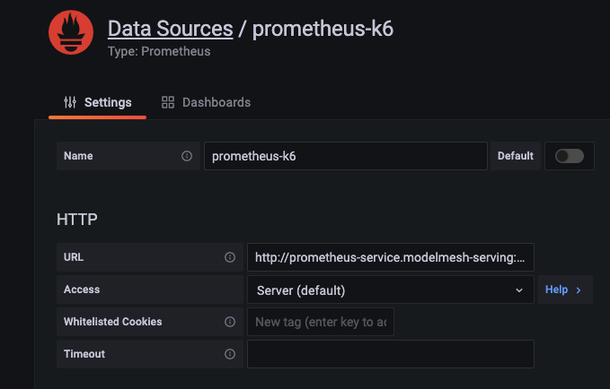
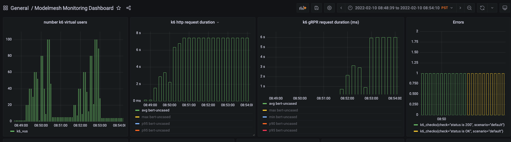

# k6 ModelMesh Scripts Quick Start
## Prerequisites
1. Install [Modelmesh-serving](https://github.com/kserve/modelmesh-serving/blob/main/docs/quickstart.md)
2. Create a predictor:
   ``` bash
    kubectl apply -f - <<EOF
    apiVersion: serving.kserve.io/v1alpha1
    kind: Predictor
    metadata:
    name: example-mnist-predictor
    spec:
    modelType:
        name: sklearn
    path: sklearn/mnist-svm.joblib
    storage:
        s3:
        secretKey: localMinIO
    EOF
   ```
## Using k6 script
1. Install [k6](https://k6.io/docs/getting-started/installation/)
2. Run a script with k6 CLI:
   ```bash
   cd k6_test
   # May need to alter the modelmesh-serving endpoint in the script to your own
   # 10 virtual users for 10s.
   k6 run --vus 10 -duration 10s grpc/script_grpc_skmnist.js
   ```
   Exect to see something:
   ```
    running (00m1.2s), 0/10 VUs, 10 complete and 0 interrupted iterations
    default ✓ [======================================] 1 VUs  00m01.2s/10m0s  10/10 shared iters

        ✓ status is OK

        checks...............: 100.00% ✓ 10       ✗ 0
        data_received........: 6.5 MB  5.2 MB/s
        data_sent............: 7.3 kB  5.9 kB/s
        grpc_req_duration....: avg=102.98ms min=91.89ms  med=97.96ms  max=127.92ms p(90)=121.3ms  p(95)=124.61ms
        iteration_duration...: avg=122.81ms min=108.46ms med=116.37ms max=160.36ms p(90)=149.17ms p(95)=154.76ms
        iterations...........: 10      8.094796/s
        vus..................: 1       min=1      max=1
        vus_max..............: 1       min=1      max=1
    ```
   The default (without any option) is equivalent to 1 user 1 iteration. See a list of CLI [options](https://k6.io/docs/using-k6/options/).

## Run script inside a container
3. Alternatively, same script may run inside a prebuilt container:
    ```bash
    docker run -i loadimpact/k6 run - <grpc/script_grpc_skmnist.js
    ```

## Send k6 metrics to a Prometheus
The release version k6 does not come with the [Prometheus remote write extension](https://github.com/grafana/xk6-output-prometheus-remote.git). Download the [custom k6 builder xk6](https://github.com/grafana/xk6/releases) and follow the [instruction](https://github.com/grafana/xk6-output-prometheus-remote#usage) to build a custom k6 binary with the remote write extension.

Also, note the Prometheus `remote write api` is an experimental feature which needs to enabled with `"--enable-feature=remote-write-receiver"` option in the startup command. You may want to use this [yaml](../docs/prometheus/prometheus.yaml), to quickly setup a standalone Prometheus server with this feature enabled.

Once built custom k6 and setup standalone Prometheus(assuming endpoint `prometheus-service:9090`  ), run the custom k6:

```bash
K6_PROMETHEUS_REMOTE_URL=http://prometheus-service:9090/api/v1/write ./k6 run -u10 -d10s script_grpc_bert.js -o output-prometheus-remote
```

## View k6 metrics in Grafana
1. Click the gear icon -> Add a Data Source -> Save and Test.

    
2. Download and Import the sample [dashboard](Modelmesh_Monitoring_Dashboard_with_k6.json) to the Grafana by.
   

## Additional BERT models
The two BERT models used in the k6 scripts are built into [this Minio docker image](https://hub.docker.com/r/tedhtchang/modelmesh-minio-other-examples). Once the minio image runs inside your own ModelMesh-serving cluster, the models can be deployed as predictors using:
```bash
kubectl apply -f - <<EOF
apiVersion: serving.kserve.io/v1alpha1
kind: Predictor
metadata:
  name: bert-uncased
spec:
  modelType:
    name: tensorflow
  path: tensorflow/bert_en_uncased_L-12_H-768_A-12_3/
  storage:
    s3:
      secretKey: localMinIO
EOF
```
and
```bash
kubectl apply -f - <<EOF
apiVersion: serving.kserve.io/v1alpha1
kind: Predictor
metadata:
  name: experts-bert-wiki-books-sst2-2
spec:
  modelType:
    name: tensorflow
  path: tensorflow/experts_bert_wiki_books_sst2_2/
  storage:
    s3:
      secretKey: localMinIO
EOF
```
Sample Request:
Using gRPC

```bash
grpcurl -plaintext -proto kfs_inference_v2.proto -d '{"model_name":"bert-uncased", "inputs":[{"name":"input_word_ids", "shape": [1, 16], "datatype":"INT32","contents":{"int_contents":[101,1045,2293,13137,20968,102,1045,2293,13137,20968,102,0,0,0,0,0]}}, {"name":"input_mask", "shape":[1,16], "datatype":"INT32","contents":{"int_contents":[1,1,1,1,1,1,1,1,1,1,1,0,0,0,0,0]}} ,{"name": "input_type_ids","shape":[1,16], "datatype":"INT32", "contents":{"int_contents":[0,0,0,0,0,0,1,1,1,1,1,0,0,0,0,0]}}]}' modelmesh-serving:8033 inference.GRPCInferenceService.ModelInfer
```
```bash
grpcurl -plaintext -proto kfs_inference_v2.proto -d '{"model_name":"experts-bert-wiki-books-sst2-2", "inputs":[{"name":"input_word_ids", "shape": [1, 128], "datatype":"INT32","contents":{"int_contents":[  101,  2182,  2057,  2175,  2059,  1010,  2017,  1998,  1045,  2003,  1037,  2639,  2201,  2011,  5046,  3769,  3063, 22294,  2368, 16768,  1012,  2009,  2001, 16768,  1005,  1055,  2117,  3729,  2004,  1037,  3948,  3063,  1012,   102, 0, 0, 0, 0, 0, 0, 0, 0, 0, 0, 0, 0, 0, 0, 0, 0, 0, 0, 0, 0, 0, 0, 0, 0, 0, 0, 0, 0, 0, 0, 0, 0, 0, 0, 0, 0, 0, 0, 0, 0, 0, 0, 0, 0, 0, 0, 0, 0, 0, 0, 0, 0, 0, 0, 0, 0, 0, 0, 0, 0, 0, 0, 0, 0, 0, 0, 0, 0, 0, 0, 0, 0, 0, 0, 0, 0, 0, 0, 0, 0, 0, 0, 0, 0, 0, 0, 0, 0, 0, 0, 0,0,0,0]}
}, {"name":"input_mask", "shape":[1,128],"datatype":"INT32","contents":{"int_contents":[1, 1, 1, 1, 1, 1, 1, 1, 1, 1, 1, 1, 1, 1, 1, 1, 1, 1, 1, 1, 1, 1, 1, 1, 1, 1, 1, 1, 1, 1, 1, 1, 1, 1, 0, 0, 0, 0, 0, 0, 0, 0, 0, 0, 0, 0, 0, 0, 0, 0, 0, 0, 0, 0, 0, 0, 0, 0, 0, 0, 0, 0, 0, 0, 0, 0, 0, 0, 0, 0, 0, 0, 0, 0, 0, 0, 0, 0, 0, 0, 0, 0, 0, 0, 0, 0, 0, 0, 0, 0, 0, 0, 0, 0, 0, 0, 0, 0, 0, 0, 0, 0, 0, 0, 0, 0, 0, 0, 0, 0, 0, 0, 0, 0, 0, 0, 0, 0, 0, 0, 0, 0, 0, 0, 0, 0, 0, 0]}
} ,{"name": "input_type_ids","shape":[1,128], "datatype":"INT32", "contents":{"int_contents":[0, 0, 0, 0, 0, 0, 0, 0, 0, 0, 0, 0, 0, 0, 0, 0, 0, 0, 0, 0, 0, 0, 0, 0, 0, 0, 0, 0, 0, 0, 0, 0, 0, 0, 0, 0, 0, 0, 0, 0, 0, 0, 0, 0, 0, 0, 0, 0, 0, 0, 0, 0, 0, 0, 0, 0, 0, 0, 0, 0, 0, 0, 0, 0, 0, 0, 0, 0, 0, 0, 0, 0, 0, 0, 0, 0, 0, 0, 0, 0, 0, 0, 0, 0, 0, 0, 0, 0, 0, 0, 0, 0, 0, 0, 0, 0, 0, 0, 0, 0, 0, 0, 0, 0, 0, 0, 0, 0, 0, 0, 0, 0, 0, 0, 0, 0, 0, 0, 0, 0, 0, 0, 0, 0, 0, 0, 0, 0]}}], "outputs":[{"name":"bert_encoder_1"}]}' modelmesh-serving:8033 inference.GRPCInferenceService.ModelInfer
```
Using REST API
```bash
curl -X POST -k -k http://modelmesh-serving:8008/v2/models/bert-uncased/infer -d '{"inputs":[{"name":"input_word_ids", "shape": [1, 16], "datatype":"INT32", "data":[101,1045,2293,13137,20968,102,1045,2293,13137,20968,102,0,0,0,0,0]}, {"name":"input_mask", "shape":[1,16], "datatype":"INT32", "data":[1,1,1,1,1,1,1,1,1,1,1,0,0,0,0,0]} ,{"name": "input_type_ids","shape":[1,16], "datatype":"INT32", "data":[0,0,0,0,0,0,1,1,1,1,1,0,0,0,0,0]}]}'
```
```bash
curl -X POST -k -k http://modelmesh-serving:8008/v2/models/experts-bert-wiki-books-sst2-2/infer -d '{"inputs":[{"name":"input_word_ids", "shape": [1, 128], "datatype":"INT32","data":[  101,  2182,  2057,  2175,  2059,  1010,  2017,  1998,  1045,  2003,  1037,  2639,  2201,  2011,  5046,  3769,  3063, 22294,  2368, 16768,  1012,  2009,  2001, 16768,  1005,  1055,  2117,  3729,  2004,  1037,  3948,  3063,  1012,   102, 0, 0, 0, 0, 0, 0, 0, 0, 0, 0, 0, 0, 0, 0, 0, 0, 0, 0, 0, 0, 0, 0, 0, 0, 0, 0, 0, 0, 0, 0, 0, 0, 0, 0, 0, 0, 0, 0, 0, 0, 0, 0, 0, 0, 0, 0, 0, 0, 0, 0, 0, 0, 0, 0, 0, 0, 0, 0, 0, 0, 0, 0, 0, 0, 0, 0, 0, 0, 0, 0, 0, 0, 0, 0, 0, 0, 0, 0, 0, 0, 0, 0, 0, 0, 0, 0, 0, 0, 0, 0, 0,0,0,0]}, {"name":"input_mask", "shape":[1,128],"datatype":"INT32","data":[1, 1, 1, 1, 1, 1, 1, 1, 1, 1, 1, 1, 1, 1, 1, 1, 1, 1, 1, 1, 1, 1, 1, 1, 1, 1, 1, 1, 1, 1, 1, 1, 1, 1, 0, 0, 0, 0, 0, 0, 0, 0, 0, 0, 0, 0, 0, 0, 0, 0, 0, 0, 0, 0, 0, 0, 0, 0, 0, 0, 0, 0, 0, 0, 0, 0, 0, 0, 0, 0, 0, 0, 0, 0, 0, 0, 0, 0, 0, 0, 0, 0, 0, 0, 0, 0, 0, 0, 0, 0, 0, 0, 0, 0, 0, 0, 0, 0, 0, 0, 0, 0, 0, 0, 0, 0, 0, 0, 0, 0, 0, 0, 0, 0, 0, 0, 0, 0, 0, 0, 0, 0, 0, 0, 0, 0, 0, 0]} ,{"name": "input_type_ids","shape":[1,128], "datatype":"INT32", "data":[0, 0, 0, 0, 0, 0, 0, 0, 0, 0, 0, 0, 0, 0, 0, 0, 0, 0, 0, 0, 0, 0, 0, 0, 0, 0, 0, 0, 0, 0, 0, 0, 0, 0, 0, 0, 0, 0, 0, 0, 0, 0, 0, 0, 0, 0, 0, 0, 0, 0, 0, 0, 0, 0, 0, 0, 0, 0, 0, 0, 0, 0, 0, 0, 0, 0, 0, 0, 0, 0, 0, 0, 0, 0, 0, 0, 0, 0, 0, 0, 0, 0, 0, 0, 0, 0, 0, 0, 0, 0, 0, 0, 0, 0, 0, 0, 0, 0, 0, 0, 0, 0, 0, 0, 0, 0, 0, 0, 0, 0, 0, 0, 0, 0, 0, 0, 0, 0, 0, 0, 0, 0, 0, 0, 0, 0, 0, 0]}], "outputs":[{"name":"bert_encoder_1"}]}'
```

